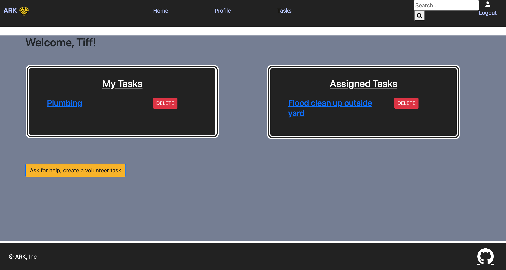

# Act-Of-Random-Kindness

## Table of Contents
  * [User Story](#user-story)
  * [Mission](#mission)
  * [GITHUB page](#github-page)
  * [Demo Link](#demo-link)
  * [Screenshots](#screenshots)
  * [Contributors](#contributors)

## User Story

    * As a user or a person who needs help, I am able to login and create a task with location  and post those task for volunteers to browse and offer help. I’m also able to update and delete my task.

    * As a user or a volunteer, I am able to login and browse task, view individual task, view details and location of task. I am also able to offer my services to open tasks.

## Background

    We all need some kind of help in our daily lives. That is how the society was built and had prospered over time. We belive the need to provide users with a platform to connect to their community and offer to help out, and share their skills. We also belive that users with difficult afinancial situations should still be able to seek help.

## Mission
    * to build an web application that allows users who need help to post their task and also view and accept tasks posted by other users
    * a task location is to attached to the task so the volunteer can calculate the distance in between 
    * have a clean, polished and responsive user interface

## Usage

## GITHUB page

[Github](https://github.com/jcarait/act-of-random-kindness)

## Demo Link

https://act-of-random-kindness.herokuapp.com/

Recommended username and password for demo:

User: roman
PW: Password12345

# Screenshots

  
  

  
  

  
  

## Contributors
  ### Reach out here: 
  [roman-ac](https://github.com/roman-ac)

  [jcarait](https://github.com/jcarait)

  [LamekMarouf](https://github.com/LamekMarouf)
  
  [tiffmoon](https://github.com/tiffmoon)
